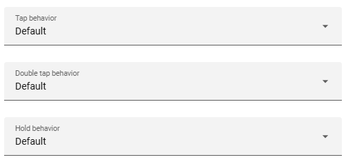

# Global Actions

Actions that apply to all domains and device classes (can be overridden per item). Default is more info for persons and the custom popup for all other items.

!!! info "Info"
    You can use different actions at the same time.

- **tap\_action:** Action on tap (default: more-info)
- **hold\_action:** Action on hold (default: more-info)
- **double\_tap\_action:** Action on double tap (default: more-info)



---

## Supported Actions

`default`, `more-info`, `toggle`, `navigate`, `url`, `perform-action`, `none`

!!! info "Info"
    I've implemented the default uses of HA actions. When the action or action calls change this will probably break.

---

## YAML Example

```yaml
type: custom:status-card
tap_action:
  action: toggle
hold_action:
  action: more-info
double_tap_action:
  action: none
```
