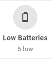
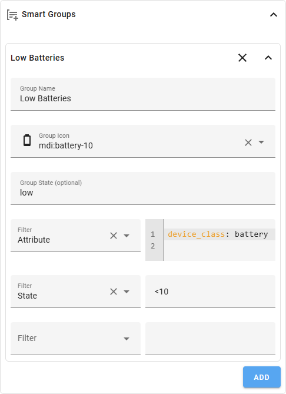

# Smart Groups

Filter-based entity grouping with rule engine. Groups are only displayed when all filters are "true".
This will let you add a group instead of a single entity.



- **Rule Keys:** 
    - area
    - floor
    - label
    - domain
    - entity_id
    - state, name
    - attributes
    - device
    - integration
    - entity_category
    - hidden_by
    - device_manufacturer
    - device_model
    - last_changed
    - last_updated
    - last_triggered
    - group


---

## Available Operators

| Operator | Example | Description |
|----------|---------|-------------|
| Exact Match | `kitchen` | Exact value |
| Wildcard | `sensor.*` | `*` before and/or after the string |
| Regex | `/pattern/` | Regular expression |
| Numeric | `<10`, `>=5` | Number comparisons |
| Time | `<30m`, `>2h`, `>=1d` | Time comparisons (minutes, hours, days) |
| Negation | `!value` | Everything except the value |

---

## Editor Settings (per Rule via customization)

| Option | Description |
|--------|-------------|
| **Group ID** | Unique group ID |
| **Group Icon** | Icon for the entire group |
| **Filter** | Any combination of rule keys |
| **Name** | Display name |
| **Icon** | Change icon |
| **Color** | Change color |
| **Tap / Hold / Double Tap** | Individual actions |



---

## YAML Example

```yaml
rulesets:
  - group_id: all_sensors
    group_icon: mdi:thermometer
    domain: sensor
    state: "*>0"
```
