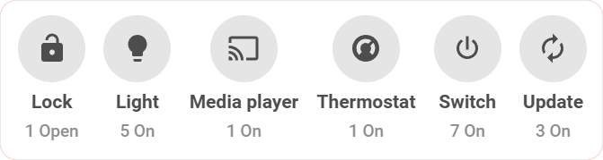
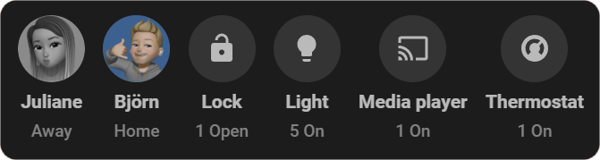

<section class="highlights-section">
  

    <h2 class="highlights-title">Everything you need for a smarter dashboard</h2>
    

      

        
🪄

        

          <h3>Zero-Configuration Magic</h3>
          
Automatically builds your dashboard from the entities and devices assigned to your Home Assistant Areas.

        

      

      

        
🔎

        

          <h3>Smart State Filtering</h3>
          
Shows only active or "on" entities, with optional inverted logic for custom use cases.

        

      

      

        
🧩

        

          <h3>Dynamic Grouping</h3>
          
Organizes active entities by domain or device_class for clear, structured views.

        

      

      

        
🧠

        

          <h3>Powerful Smart Groups</h3>
          
Build intelligent groups with multi-layered filters by state, domain, and more.

        

      

      

        
➕

        

          <h3>Extra & Ignored Entities</h3>
          
Add missing entities manually or hide specific ones you don't want to see.

        

      

      

        
💬

        

          <h3>Interactive Detail Popups</h3>
          
Tap any group to open a native popup showing all contained entities as interactive Tile Cards.

        

      

    

    <section class="hero-preview-section">
      

        

          
        

        

          
        

      

    </section>
  

</section>

  

    

      <h1 class="showcase-title reveal" style="transition-delay: 0.1s;">Ready instantly, intelligently organized</h1>
      

        Your dashboard is generated automatically from your Home Assistant Areas, showing all relevant entities without daily adjustments. Just assign devices to areas and let the card handle the rest.
      

    

    

      <h1 class="showcase-title reveal" style="transition-delay: 0.1s;">Zero-Config Magic</h1>
      

        Automatically generates your dashboard by reading the entities and devices assigned to your Home Assistant areas.
      

    

    

      <h1 class="showcase-title reveal" style="transition-delay: 0.1s;">Smart State Filtering</h1>
      

        Only shows entities that are currently active or "on", with optional inverted logic for custom use cases.
      

    

    

      <h1 class="showcase-title reveal" style="transition-delay: 0.1s;">Dynamic Grouping & Smart Groups</h1>
      

        Organizes active entities by domain or device_class and provides smart groups with flexible filters, manual additions, and hidden entities.
      

      

        

          <a href="installation/" class="u-btn-native u-btn-dark" style="color: hsla(var(--md-hue), 15%, 5%, 1);">
            GET STARTED
            

              <svg xmlns="http://www.w3.org/2000/svg" width="18" height="48" fill="none" viewBox="0 0 18 48">
                <path class="btn-path"
                  d="M0 0h5.63c7.808 0 13.536 7.337 11.642 14.91l-6.09 24.359A11.527 11.527 0 0 1 0 48V0Z"></path>
              </svg>
            

          </a>

          <a href="installation/" class="u-btn-native u-btn-lime">
            <svg xmlns="http://www.w3.org/2000/svg" width="51" height="48" fill="none" viewBox="0 0 51 48"
              class="btn-shape">
              <path class="btn-path"
                d="M6.728 9.09A12 12 0 0 1 18.369 0H39c6.627 0 12 5.373 12 12v24c0 6.627-5.373 12-12 12H12.37C4.561 48-1.167 40.663.727 33.09l6-24Z">
              </path>
            </svg>
            →
          </a>
        

      

    

  <h2 class="support-heading">Become a sponsor</h2>
  

    By supporting the <strong>Status Card</strong> project, you help ensure its ongoing development and maintenance.
    Together, we can build the best dashboard experience for Home Assistant!
  

  

    <a href="https://github.com/sponsors/" class="u-btn-native u-btn-dark" style="color: hsla(var(--md-hue), 15%, 5%, 1);">
      LEARN MORE
      

        <svg xmlns="http://www.w3.org/2000/svg" width="18" height="48" fill="none" viewBox="0 0 18 48">
          <path class="btn-path"
            d="M0 0h5.63c7.808 0 13.536 7.337 11.642 14.91l-6.09 24.359A11.527 11.527 0 0 1 0 48V0Z"></path>
        </svg>
      

    </a>
    <a href="https://github.com/sponsors/" class="u-btn-native u-btn-lime">
      <svg xmlns="http://www.w3.org/2000/svg" width="51" height="48" fill="none" viewBox="0 0 51 48"
        class="btn-shape">
        <path class="btn-path"
          d="M6.728 9.09A12 12 0 0 1 18.369 0H39c6.627 0 12 5.373 12 12v24c0 6.627-5.373 12-12 12H12.37C4.561 48-1.167 40.663.727 33.09l6-24Z">
        </path>
      </svg>
      →
    </a>
  

<h2 class="support-heading">Let's keep in touch</h2>

<ul class="support-links" markdown="1">
  <li markdown="1">[:simple-github:{ .support-link-icon } Status Card on **GitHub**](https://github.com/xBourner/status-card){ .support-link }</li>
  <li markdown="1">[:simple-discord:{ .support-link-icon } Status Card on **Discord**](https://discord.gg/RvwE65hJ){ .support-link }</li>
  <li markdown="1" style="margin-top: 1.5rem;">[:simple-paypal:{ .support-link-icon } Status Card on **PayPal**](https://www.paypal.me/gibgas123){ .support-link }</li>
  <li markdown="1">[:simple-buymeacoffee:{ .support-link-icon } Status Card on **Buy Me a Coffee**](https://www.buymeacoffee.com/bourner){ .support-link }</li>
  <li markdown="1">[:simple-githubsponsors:{ .support-link-icon } Status Card on **GitHub Sponsors**](https://github.com/sponsors/xBourner){ .support-link .support-link-nowrap }</li>

</ul>

